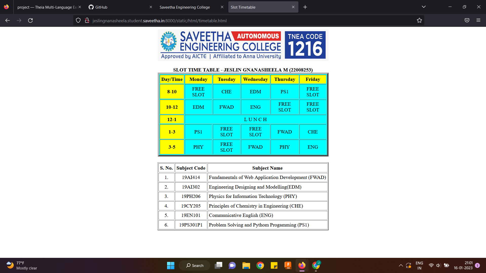
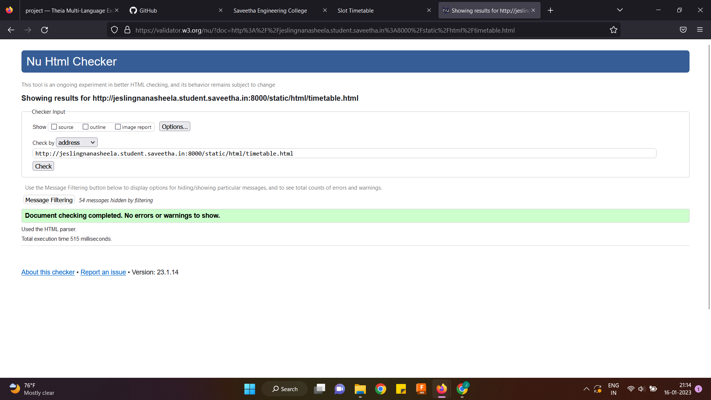

# Experiment_Time_Table

## AIM
To Write a html webpage page to display your timetable.

# ALGORITHM
### STEP 1
create a simple table using table tag

### STEP 2
Add header row using th tag

### STEP 3
Add your timetable

### STEP 4
Execute the program

# CODE
```
<!DOCTYPE html>
<html lang="en">
<head>
<title>Slot Timetable</title>
</head>
<body>
<center>

</center>
<br>
<table align="center" width="540" cellspacing="2" cellpadding="4" border="5" bgcolor="cyan">
<caption><b>SLOT TIME TABLE - JESLIN GNANASHEELA M (22008253)</b></caption>
<tr align="center">
<th bgcolor="yellow">Day/Time</th>
<th bgcolor="yellow">Monday</th>
<th bgcolor="yellow">Tuesday</th>
<th bgcolor="yellow">Wednesday</th>
<th bgcolor="yellow">Thursday</th>
<th bgcolor="yellow">Friday</th>
</tr>
<tr align="center">
<th bgcolor="yellow">8-10</th>
<td>FREE SLOT</td>
<td>CHE</td>
<td>EDM</td>
<td>PS1</td>
<td>FREE SLOT</td>
</tr>
<tr align="center">
<th bgcolor="yellow">10-12</th>
<td>EDM</td>
<td>FWAD</td>
<td>ENG</td>
<td>FREE SLOT</td>
<td>FREE SLOT</td>
</tr>
<tr>
<th bgcolor="yellow">12-1</th>
<td colspan="5" align="center">L U N C H</td>
</tr>
<tr align="center">
<th bgcolor="yellow">1-3</th>
<td >PS1 </td>
<td>FREE SLOT</td>
<td>FREE SLOT</td>
<td>FWAD</td>
<td>CHE</td>
</tr>
<tr align="center">
<th bgcolor="yellow">3-5</th>
<td>PHY</td>
<td>FREE SLOT</td>
<td>FWAD</td>
<td>PHY</td>
<td>ENG</td>
</tr>
</table>
<br>
<table align="center" cellspacing="2" cellpadding="4" border="2">
<tr align="center">
<th>S. No.</th>
<th>Subject Code</th>
<th>Subject Name</th>
</tr>
<tr>
<td align="center">1.</td>
<td align="center">19AI414</td>
<td>Fundamentals of Web Application Development (FWAD)</td>
</tr>
<tr>
<td align="center">2.</td>
<td align="center">19AI302</td>
<td>Engineering Designing and Modelling(EDM)</td>
</tr>
<tr>
<td align="center">3.</td>
<td align="center">19PH206</td>
<td>Physics for Information Technology (PHY)</td>
</tr>
<tr>
<td align="center">4.</td>
<td align="center">19CY205</td>
<td>Principles of Chemistry in Engineering (CHE)</td>
</tr>
<tr>
<td align="center">5.</td>
<td align="center">19EN101</td>
<td>Communicative English (ENG)</td>
</tr>
<tr>
<td align="center">6.</td>
<td align="center">19PS301P1</td>
<td>Problem Solving and Pythom Progamming (PS1)</td>
</tr>
</table>
</body>
</html>
```

# OUPUT


# HTML VALIDATOR


# RESULT
The program for creating slot timetable is completed successfully 
